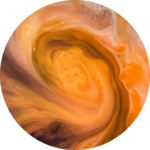
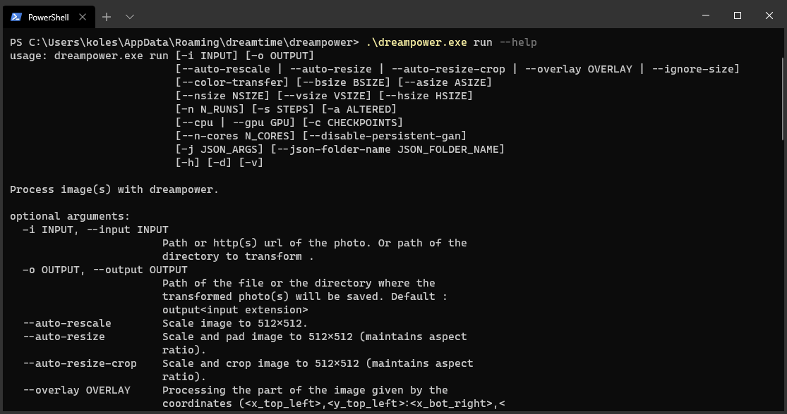

[](https://github.com/private-dreamnet/dreampower/actions)
[](https://github.com/private-dreamnet/dreampower/releases)


[](https://www.codacy.com/app/kolessios/dreampower?utm_source=github.com&amp;utm_medium=referral&amp;utm_content=private-dreamnet/dreampower&amp;utm_campaign=Badge_Grade)
[](https://codeclimate.com/github/private-dreamnet/dreampower/maintainability)

# DreamPower

DreamPower is a deep learning algorithm based on [DeepNude](https://github.com/stacklikemind/deepnude_official) with the ability to predict what a naked person's body looks like.

DreamPower is a CLI application, if you are looking for a **friendly way** to use DreamPower, please use the user interface: [DreamTime](https://time.dreamnet.tech).



## Differences with DeepNude

DreamPower is a fork of [deepnude_official](https://github.com/stacklikemind/deepnude_official) but with constant improvements from the developers of DreamNet and the world, we stand out for offering these features:

- GPU Processing (Transformation in ~10 seconds!)
- Multiple GPU support
- Multithreading
- Auto-resize, auto-rescale, etc
- Support to transform animated GIFs
- Customization: size of boobs, pubic hair, etc.
- Constant updates!

## DreamNet

Join the DreamNet social networks, the community interested in developing this technology. You can also join just to talk and make friends:

[](https://keybase.io/team/dreamnet)
[](https://twitter.com/DreamNetCom)
[](https://web.facebook.com/groups/812542509140670)

[](https://github.com/private-dreamnet) [](https://git.dreamnet.tech/dreamnet)
[](https://notabug.org/DreamNet)
[](https://gitgud.io/dreamnet)

## Support

Developing DreamNet applications is time consuming! Help us accelerate development and offer better updates!

[](https://www.patreon.com/dreampower)

## Source Code

This technology was going to arrive sooner or later and we want to keep it open and free for everyone. Help us in our goal of developing more applications with this technology.

[](https://github.com/private-dreamnet/dreampower)

[](https://git.dreamnet.tech/dreamnet/dreampower)

[](https://notabug.org/DreamNet/dreampower)

[](https://gitgud.io/dreamnet/dreampower)

If you want to share or modify this software please do it for the same purpose as we do and always release the source code of your modifications. Read the [LICENSE](LICENSE) for more information.

# 💜 Binaries

## Requirements

- 64 bits OS
- Windows 7 SP1/Windows 8/Windows 10 1803+
- Ubuntu 16.04+
- macOS
- **8 GB** of RAM or more.

## GPU Processing Requirements

- NVIDIA Graphics card with minimum [3.5 CUDA compute capability](https://developer.nvidia.com/cuda-gpus)
- [Latest NVIDIA drivers](https://www.nvidia.com/Download/index.aspx)

> 👉 If you do not have an NVIDIA or compatible graphics card you can use CPU processing.

## Download


[](https://github.com/private-dreamnet/dreampower/releases)

## Installation

- Extract the file that contains the CLI, it can be anywhere you want it, this should generate a folder called `dreampower`
- Inside the folder called `dreampower` run the CLI executable `dreampower checkpoints download` to download the checkpoints.

> When you update DreamPower it will only be necessary to download the file that contains the `DreamPower`, you can reuse the checkpoints (unless we tell you otherwise)

## Using package manager

### Archlinux (AUR)

Available on the [Archlinux User Repository](https://aur.archlinux.org/) in two version:
* [dreampower](https://aur.archlinux.org/packages/dreampower) with CUDA Support
* [dreampower-cpu](https://aur.archlinux.org/packages/dreampower-cpu) with no CUDA Support

## Usage

In the command line terminal run:

```
dreampower --help
```

This will print out help on the parameters the algorithm accepts.

> **The input image should be 512px * 512px in size** (parameters are provided to auto resize/scale your input).

---

# 💻 Development > 🚧 Area only for developers!

> **If you are a developer:** Consider making a fork of the project and make PR of any improvement you can do, also join our server in [Keybase](https://keybase.io/team/dreamnet) where we have channels exclusively for development.

## Requirements

- [Python 3.5+](https://www.python.org/downloads/)

## Prerequisite

Before you can launch the main alogirthm script you'll need to install certain packages in your **Python3** environment.

We've added a setup script for the supported OSes in the 'scripts' folder that will do this for you.

The following OSes are supported:

- Windows
- MacOS
- Linux

## Launch the script

```
python3 main.py --help
```

This will print out help on the parameters the algorithm accepts.

> **The input image should be 512px * 512px in size** (parameters are provided to auto resize / scale your input).

---

# How does DreamPower work?

DreamPower uses an interesting method to solve a typical AI problem, so it could be useful for researchers and developers working in other fields such as *fashion*, *cinema* and *visual effects*.

The algorithm uses a slightly modified version of the [pix2pixHD](https://github.com/NVIDIA/pix2pixHD) GAN architecture. If you are interested in the details of the network you can study this amazing project provided by NVIDIA.

A GAN network can be trained using both **paired** and **unpaired** dataset. Paired datasets get better results and are the only choice if you want to get photorealistic results, but there are cases in which these datasets do not exist and they are impossible to create. A database in which a person appears both naked and dressed, in the same position, is extremely difficult to achieve, if not impossible.

We overcome the problem using a *divide-et-impera* approach. Instead of relying on a single network, we divided the problem into 3 simpler sub-problems:

- 1. Generation of a mask that selects clothes
- 2. Generation of a abstract representation of anatomical attributes
- 3. Generation of the fake nude photo

## Original problem:


## Divide-et-impera problem:


This approach makes the construction of the sub-datasets accessible and feasible. Web scrapers can download thousands of images from the web, dressed and nude, and through photoshop you can apply the appropriate masks and details to build the dataset that solve a particular sub problem. Working on stylized and abstract graphic fields the construction of these datasets becomes a mere problem of hours working on photoshop to mask photos and apply geometric elements. Although it is possible to use some automations, the creation of these datasets still require great and repetitive manual effort.

## Computer Vision Optimization

To optimize the result, simple computer vision transformations are performed before each GAN phase, using OpenCV. The nature and meaning of these transformations are not very important, and have been discovered after numerous trial and error attempts.

Considering these additional transformations, the phases of the algorithm are the following:

- **dress -> correct** [OPENCV]
- **correct -> mask** [GAN]
- **mask -> maskref** [OPENCV]
- **maskref -> maskdet** [GAN]
- **maskdet -> maskfin** [OPENCV]
- **maskfin -> nude** [GAN]


